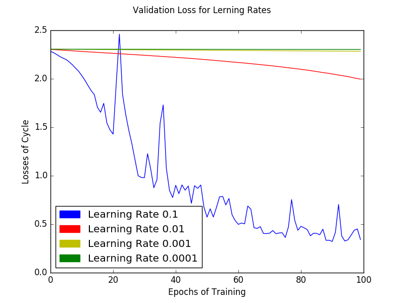
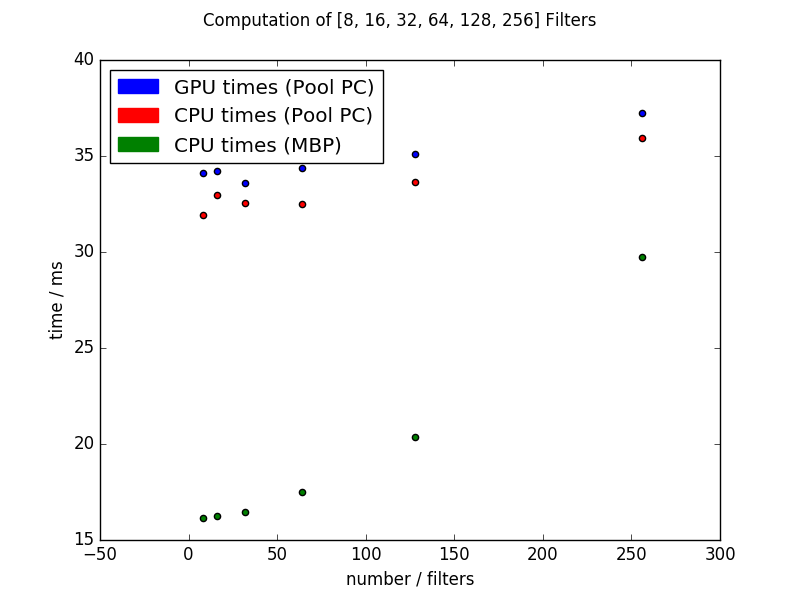

# Report Exercise 2
In general it was hard to handle pool computers but finally it works. Problems come from quotas mainly.

Because of missleading messages from CUDA I thought Tensorflow everytime uses the GPU:0. To compare it with CPU computations I first compared Pool PC GPU with the CPU of my Mac Book Pro (MBP). Later I got the point but left the measurements in this report.

# CNN
The submitted code bases mostly on the Tensorflow Example [1] and was extended by the need from the exercise. The extended parts are documented in the code.
Because the convolution layers should keep its size they are padded.
The max pools got a size of 2x2 and a stride of 2.
The optimizing of the cross-entropy loss is done by SGD with a batch of 64.

# Changing the Learning Rate

With higher learning rate the optimization takes less epoches. With 100 epoches only 10% lerning rate was suficient. Learning rates of 0,1% and lower were nearly useless for the experiment. The shown learning rates are computed with the Pools GPU.

# Runtime
Using a GPU the runtime is increased very strong due to its parallel working strategy.

~~~
GPU Training on a Pool PC
5.1e+01 ms with GPU for 8 filters
5.2e+01 ms with GPU for 16 filters
5.4e+01 ms with GPU for 32 filters
5.8e+01 ms with GPU for 64 filters
6.7e+01 ms with GPU for 128 filters
9e+01 ms with GPU for 256 filters
~~~

~~~
CPU Training on a Mac Book Pro
1.6e+01 ms with CPU for 8 filters
1.6e+01 ms with CPU for 16 filters
1.6e+01 ms with CPU for 32 filters
1.7e+01 ms with CPU for 64 filters
2e+01 ms with CPU for 128 filters
2.9e+01 ms with CPU for 256 filters
~~~

The MBPs installation of Tensorflow was not compiled optimal which means the shown values could be increased by fixing this:

~~~
Your CPU supports instructions that this TensorFlow 
binary was not compiled to use: 

SSE4.1 
SSE4.2 
AVX 
AVX2 
FMA
~~~
A **basical** research found it is an abstract implementation of SIMD which is array computing on a CPU similar a GPU does.
# Conclusion
Finally the learning effect is: One needs a good GPU also for basical Deep Learning trainings. The use of CPU only would slow down the development workflow dramatically.

[1]	https://www.tensorflow.org/versions/master/tutorials/layers